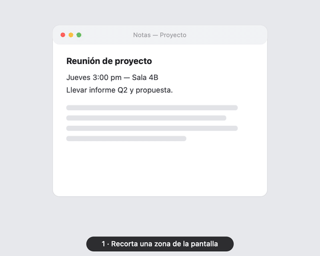

<div align="center">

# 📋 Klip

**Tu portapapeles con superpoderes, nativo para Mac.** Todo lo que copias, a un atajo de distancia.

Historial de texto e imágenes · búsqueda instantánea · **notas de voz → texto** (OpenAI o Gemini) · **OCR** · Markdown · y más. Vive en la barra de menú: ligero, rápido y privado.

🆓 Gratis y open source (MIT) · 🔒 Sin telemetría · 🍎 Swift nativo (sin Electron)

<br/>



<sub>Recorta una zona → aparece en Klip → extrae el texto (OCR) · y graba una nota de voz que se transcribe sola.</sub>

</div>

> ### 🖥️ Por ahora, solo para Mac
> Klip es una app **nativa de macOS** y requiere **macOS 14 (Sonoma) o superior** (Apple Silicon o Intel).
> La versión para **Windows 🪟 llegará más adelante**. Tus datos se quedan en tu equipo.

---

## ✨ Funciones

### 📋 Portapapeles
- **Historial automático** de **texto e imágenes/capturas**.
- **Búsqueda** instantánea con **resaltado** de coincidencias + **navegación por teclado** (↑/↓, Enter, `⌘1`–`⌘9`, `Esc`).
- **Filtros** por tipo: texto · imágenes · voz · credenciales · fijados.
- **Pegado automático** en la app activa · **Fijar** 📌 · **Eliminar** 🗑️ (con confirmación al borrar todo).
- **Fecha legible** en cada elemento: *"martes 04 de julio · 10:43"*, *"Hoy"*, *"Ayer"*.

### 🖼️ Imágenes
- Previsualización grande (miniaturas en caché para que el scroll vaya fluido), **abrir en grande** y **guardar como archivo**.
- **OCR** (extraer texto de una imagen) con el motor **Vision** de Apple — gratis y en el dispositivo.

### 🎙️ Notas de voz → texto
- **Graba** o **sube un archivo** (m4a, mp3, wav, **.opus de WhatsApp**, ogg, flac…).
- Se transcribe **en segundo plano** — puedes grabar otra al instante.
- **El audio original se guarda** con **duración** y **barra de progreso**: lo reproduces (▶) o lo abres en Finder, y puedes **reintentar (↻)** si la transcripción falla.

### 🤖 IA: tú eliges el motor
- **OpenAI** o **Google Gemini** para la transcripción. Pones tu propia clave de cualquiera de los dos.

### 🏷️ Organización
- **Ponle nombre a cualquier elemento** y búscalo por ese nombre (ideal para tus credenciales).
- **Acciones por tipo**: **abrir enlaces** 🔗 y **muestra de color** para valores hex (`#1E90FF`).
- **Markdown**: copia un elemento *como Markdown* o exporta **todo el historial**.
- **Mini gestor de credenciales** 🔑: detecta tokens y API keys al copiarlos, los guarda **enmascarados** (👁 para revelar/copiar), con su propio filtro.

### 💾 Copia de seguridad
- **Exportar / importar** todo el historial (imágenes y audio incluidos) en un `.zip`. **Nunca** incluye tus claves de API.

### 🔒 Privacidad y sistema
- Todo **local** con permisos `0600` · **sin telemetría** · ignora contraseñas y permite **excluir apps**.
- **Firma estable**: macOS te pide los permisos (micrófono…) **una sola vez** y los recuerda entre actualizaciones.
- **Arranque al iniciar sesión** opcional · 🌍 **Español / Inglés**.

## ⌨️ Atajos

| Atajo | Acción |
|---|---|
| `⌘⇧E` | Abrir el panel del historial |
| `⌘⇧I` | Grabar una nota de voz |
| `↑` / `↓` · `Enter` | Navegar y elegir un elemento |
| `⌘1`–`⌘9` | Elegir (y pegar) el elemento Nº 1–9 |
| `Esc` | Cerrar el panel |
| `⌘⇧⌃4` | *(de macOS)* captura de pantalla al portapapeles → entra a Klip |

> `⌘⇧E` y `⌘⇧I` son **configurables** en Preferencias.

## 🧰 Requisitos

- **macOS 14 (Sonoma) o superior** — probado en macOS 26, Apple Silicon.
- **Command Line Tools de Xcode** (no hace falta Xcode completo):
  ```bash
  xcode-select --install
  ```
- *(Opcional)* Una **API key de OpenAI** para las notas de voz y el Markdown por IA. Se guarda en un **archivo local** de la app, nunca en el código ni en el repositorio.

## ⚡ Instalación rápida

```bash
git clone <URL-de-tu-repositorio> klip
cd klip
./install.sh
```

Eso compila Klip, lo firma, lo copia a `/Applications`, lo lanza y registra el arranque al inicio.
Verás el icono 📋 en la barra de menú. Pulsa **`⌘⇧E`** para abrir el historial.

> La primera vez, `install.sh` crea un **certificado de firma local** (`Klip Code Signing`) en tu Llavero para que la firma sea estable. Así macOS te pide los permisos (micrófono, accesibilidad) **una sola vez** y los recuerda entre actualizaciones, en lugar de volver a preguntar en cada reinstalación. Es local y reversible (puedes borrarlo desde *Acceso a Llaveros*).
>
> macOS puede pedir aprobar el "ítem de inicio de sesión" en *Ajustes › General*. Para el **pegado automático**, concede Accesibilidad cuando se solicite (menú de Klip → *Activar pegado automático…*).

### Compilar sin instalar

```bash
./build.sh        # genera Klip.app en la carpeta del proyecto
open Klip.app
```

### Desarrollo

```bash
swift build       # compilación de depuración
swift run Klip    # ejecuta directamente
```

## 🚀 Uso

1. Copia lo que sea (texto, o una captura con `⌘⇧⌃4`, que va al portapapeles).
2. Pulsa **`⌘⇧E`** → se abre el panel.
3. Escribe para **buscar**; usa **↑/↓ + Enter** o haz **clic** para elegir un elemento (se pega solo si activaste el pegado automático).
4. Pasa el cursor sobre una fila para ver acciones: copiar, guardar imagen, **OCR**, **Markdown**, fijar, eliminar.
5. 🎙️ Pulsa el **micrófono** para grabar una nota de voz; al detener, se transcribe y entra al historial.
6. 📝 Botón **Markdown** del encabezado: copia **todo** el historial como Markdown.
7. `Esc` o clic fuera cierra el panel.

## ⚙️ Configuración

Abre **Preferencias** (`⌘,` desde el menú de Klip):

- **Atajos** — graba las combinaciones que prefieras (panel y voz).
- **Transcripción de voz** — elige **proveedor** (OpenAI o Google Gemini), modelo e idioma.
- **OpenAI** — pega tu API key (`sk-…`). Se guarda en un archivo local `0600`.
- **Google Gemini** — pega tu API key (`AIza…`, de [aistudio.google.com](https://aistudio.google.com)). Se guarda en un archivo local `0600`.
- **Historial** — número máximo de elementos.
- **Privacidad** — ignorar contraseñas/contenido sensible, excluir apps.

## 🔐 Privacidad

- **Local primero**: tu historial vive en `~/Library/Application Support/Klip/` (`items.json` + `images/` + `audio/`). Nada sale de tu Mac salvo el audio que **tú** envías al proveedor de IA que elijas (OpenAI o Gemini) para transcribir.
- **Sin secretos en el repo**: las API keys se guardan en **archivos locales** (`openai.key`, `gemini.key`, permisos `0600`), jamás en el código ni en el repositorio.
- El **historial** (`items.json`), las **imágenes** y el **audio** de las notas de voz se guardan solo en tu Mac con permisos `0600` (carpetas `0700`). El enmascarado de credenciales es visual; el contenido vive localmente como el resto del historial.
- **Sin telemetría**.
- Klip **ignora** el contenido marcado como oculto por los gestores de contraseñas, y puedes **excluir** apps concretas.
- Los **tokens/API keys** que copies se detectan y se guardan **enmascarados** (filtro 🔑).

## 🏗️ Arquitectura

| Archivo | Responsabilidad |
|---|---|
| `main.swift` / `AppDelegate.swift` | Arranque, barra de menú, atajo global. |
| `ClipboardManager.swift` | Monitoreo del portapapeles, historial, origen, privacidad. |
| `ClipboardItem.swift` / `Storage.swift` | Modelo y persistencia (JSON + imágenes + audio). |
| `PanelController.swift` / `HistoryView.swift` | Panel HUD y la interfaz (SwiftUI). |
| `HotKey.swift` / `Settings.swift` | Atajo (Carbon) y preferencias (UserDefaults). |
| `OCR.swift` | Extracción de texto con Vision. |
| `Recorder.swift` / `AudioPlayer.swift` | Grabación, transcripción en 2º plano y reproducción de notas de voz. |
| `OpenAIClient.swift` / `GeminiClient.swift` | Transcripción vía OpenAI o Google Gemini (proveedor seleccionable). |
| `SecretStore.swift` | API keys en archivos locales `0600` (`openai.key`, `gemini.key`). |
| `Paster.swift` / `LoginItem.swift` | Auto-pegado y arranque al inicio. |
| `Markdownify.swift` | Conversión y exportación a Markdown (local). |

## 🗺️ Hoja de ruta

**Por ahora Klip es solo para Mac.** Lo siguiente:

- [ ] **Versión para Windows** 🪟 — el gran próximo paso.
- [ ] Más acciones rápidas por tipo (código, correos, números).
- [ ] Traducir / resumir / limpiar texto con IA.
- [ ] Colecciones / favoritos · sincronización opcional entre Macs.
- [ ] Firma con Developer ID + notarización para distribución sin avisos.

**Ya disponible:** historial texto+imágenes · OCR · notas de voz (OpenAI/Gemini) con audio guardado y reintento · nombrar y buscar · abrir enlaces y muestra de color · Markdown · exportar/importar · firma estable.

## 🤝 Contribuir

¡Las contribuciones son bienvenidas! Abre un *issue* o un *pull request*. El proyecto compila solo con las Command Line Tools (sin Xcode), así que es fácil de arrancar.

## 👤 Autor

Creado y dirigido por **Martin Velasco O.** — [@tamibot](https://github.com/tamibot) · Proper.

## 📄 Licencia

[MIT](LICENSE) © 2026 Martin Velasco O. — úsalo, modifícalo y compártelo libremente.
